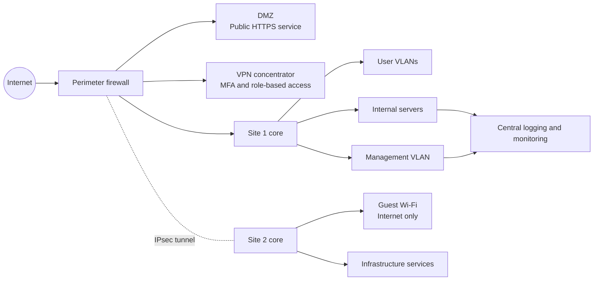

# Secure Multi-Site Network Architecture

A technical architecture study for a secure multi-site network serving a mid-sized company with approximately 100 users. The project translates business and security requirements into a vendor-neutral network design.

## Executive Summary

The design separates business users, sensitive departments, shared services, management, guest access and public-facing services into controlled security zones. It combines VLAN segmentation, firewall policy, IPsec connectivity, remote access, monitoring and risk reduction measures.

## Reference Architecture

## Security Zones

| Zone | Purpose | Main control |
| --- | --- | --- |
| User VLANs | Department workstations | Inter-VLAN firewall policy |
| Server VLAN | Internal business services | Least-privilege service flows |
| DMZ | Public HTTPS service | Inbound 443 only; restricted database access |
| Guest Wi-Fi | Untrusted devices | Internet-only access and client isolation |
| Management VLAN | Administration and monitoring | Restricted operator access |
| VPN pools | Remote and site-to-site access | MFA, role-based ACLs and encrypted tunnels |

## Design Principles

- Use RFC1918 addressing with a separate plan for each site.
- Keep sensitive departments and infrastructure services in dedicated zones.
- Route all inter-zone traffic through explicit firewall policy.
- Expose public services through the DMZ instead of the internal network.
- Treat guest and remote access as untrusted until authenticated and authorized.
- Collect firewall, VPN and infrastructure events for detection and investigation.

## Deliverable

The complete technical document is available in [DAT.pdf](DAT.pdf). It covers assumptions, scope, threat considerations, VLAN allocation, addressing principles, VPN design, firewall boundaries and risk-reduction measures.

## References

The study is informed by GDPR principles, ISO/IEC 27001 and 27002, and ANSSI security guidance. It is an academic architecture proposal, not a turnkey production configuration.

## Author

Thomas Teixeira

## Status

Completed academic network-security architecture project developed during the ETNA curriculum.